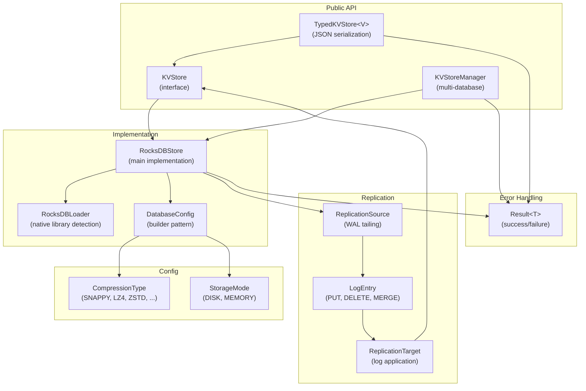
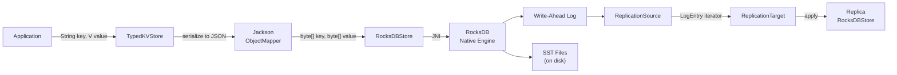
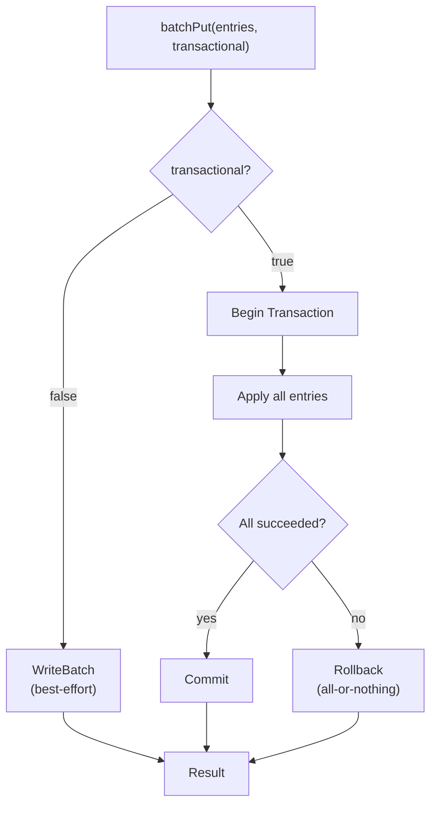
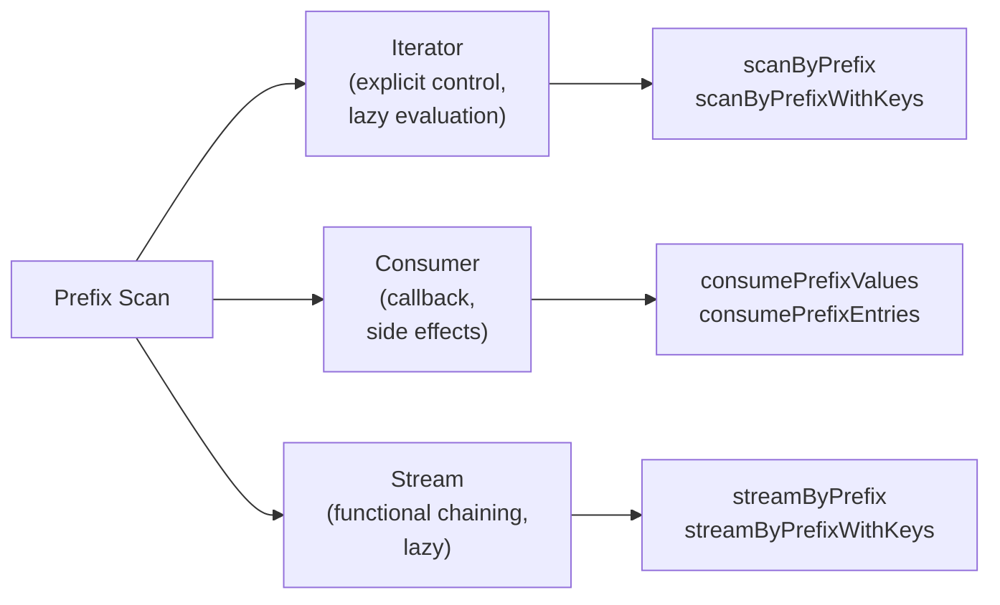
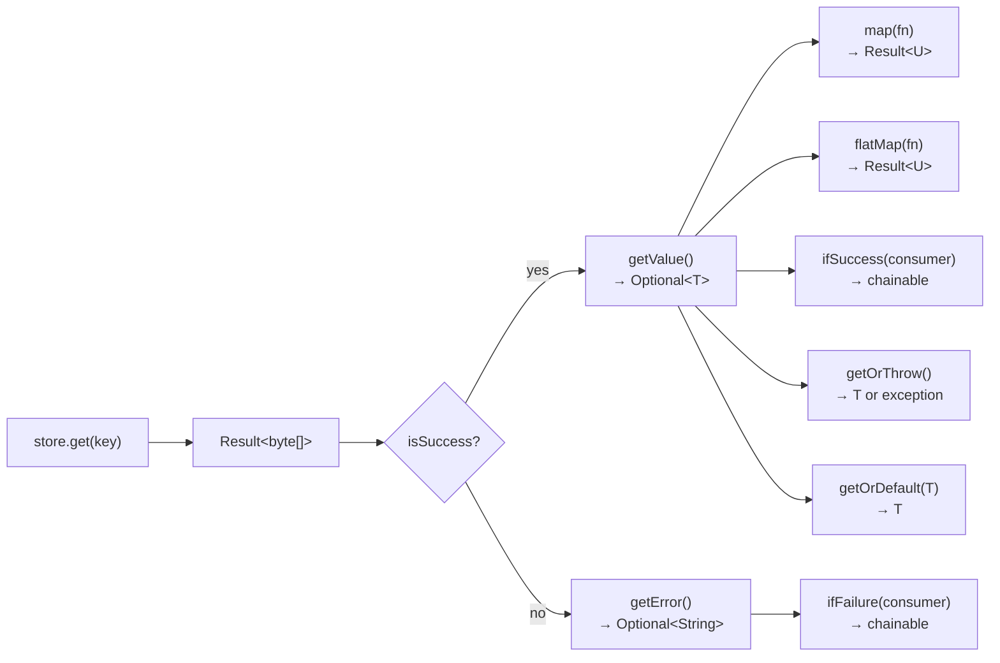
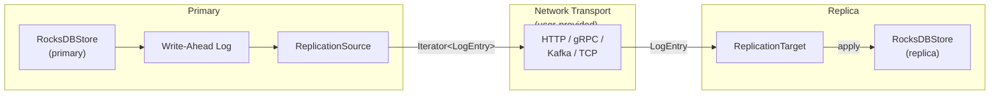
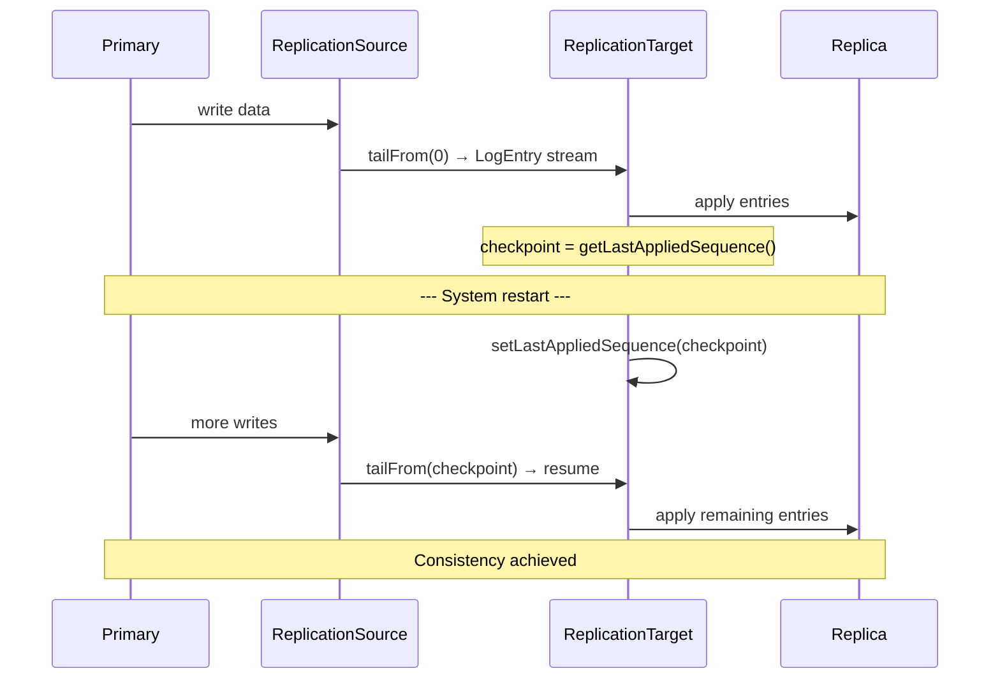

# Hitorro KVStore

A high-performance, feature-rich RocksDB wrapper for Java 21+ providing multiple access patterns, WAL-based replication, type-safe serialization, and flexible configuration options.

---

## Table of Contents

- [Features](#features)
- [Prerequisites](#prerequisites)
- [Installation](#installation)
- [Building](#building)
- [Testing](#testing)
- [Architecture](#architecture)
- [Quick Start](#quick-start)
- [DatabaseConfig](#databaseconfig)
- [Basic Operations](#basic-operations)
- [Batch Operations](#batch-operations)
- [Prefix Scanning & Streaming](#prefix-scanning--streaming)
- [TypedKVStore](#typedkvstore)
- [Multi-Database Management](#multi-database-management)
- [Result Pattern](#result-pattern)
- [Replication](#replication)
- [Key Design Best Practices](#key-design-best-practices)
- [Configuration Reference](#configuration-reference)
- [Performance Tuning](#performance-tuning)

---

## Features

- **Multiple Access Patterns**: Single operations, batch operations, iterators, consumers, and Java Streams
- **Prefix Queries**: Efficient scanning with prefix matching using RocksDB iterators
- **Replication Support**: Built-in WAL tailing for primary-replica setups with checkpoint/resume
- **Transactional & Non-Transactional Batches**: ACID guarantees when needed, performance when not
- **Configurable Compression**: Snappy, LZ4, LZ4HC, ZSTD, ZLIB, or none
- **Type-Safe Wrapper**: Automatic JSON serialization/deserialization via `TypedKVStore`
- **Result Pattern**: Clean error handling without exceptions
- **Resource Management**: Automatic cleanup with shutdown hooks and `AutoCloseable`
- **Multi-Database Management**: `KVStoreManager` for managing multiple database instances
- **Disk and Memory Modes**: Persistent storage or in-memory for caching/testing

---

## Prerequisites

| Requirement | Version | Notes |
|-------------|---------|-------|
| **Java** | 21+ | Required |
| **Maven** | 3.8+ | Required for building |

RocksDB native libraries are included as platform-specific JARs (macOS, Linux 32/64, Windows 64). The `RocksDBLoader` handles transparent platform detection and library loading.

---

## Installation

Add the dependency to your `pom.xml`:

```xml
<dependency>
    <groupId>com.hitorro</groupId>
    <artifactId>hitorro-kvstore</artifactId>
    <version>3.0.1</version>
</dependency>
```

---

## Building

```bash
cd hitorro-kvstore

# Full build with tests
mvn clean install

# Build without tests
mvn clean install -DskipTests
```

### Build Dependencies

| Library | Version | Purpose |
|---------|---------|---------|
| RocksDB | 10.4.2 | Core storage engine (JNI with platform-specific native libs) |
| hitorro-util | 3.0.1 | Shared utilities |
| Jackson | 2.18.2 | JSON serialization (TypedKVStore) |
| Log4j | 1.2.17 | Logging |
| JUnit 5 | 5.11.4 | Testing framework |
| Mockito | 5.14.2 | Mocking framework |
| AssertJ | 3.27.3 | Fluent test assertions |

---

## Testing

```bash
# Run all tests
mvn test

# Run a single test class
mvn test -Dtest=KVStoreTest

# Run a single test method
mvn test -Dtest=ReplicationDemonstrationTest#demonstrateContinuousReplication
```

### Test Coverage

| Test Class | What It Tests |
|------------|--------------|
| `KVStoreTest` | Basic put/get/delete, batch operations, prefix scan, consumers, key extraction |
| `ReplicationDemonstrationTest` | Continuous replication with disconnect/reconnect, checkpoint/resume, deletes and updates |

#### `KVStoreTest` -- Unit Tests

| Test | What It Verifies |
|------|-----------------|
| `testBasicPutAndGet` | Single key-value put and retrieval |
| `testDelete` | Delete key, verify not found |
| `testBatchPut` | Put multiple keys atomically |
| `testBatchGet` | Retrieve multiple keys in one call |
| `testPrefixScan` | Scan values by key prefix |
| `testPrefixScanWithKeys` | Scan key-value pairs by prefix |
| `testConsumer` | Consume prefix values with callback |
| `testKeyExtraction` | Store object with key extractor function |

#### `ReplicationDemonstrationTest` -- Integration Tests

| Test | Scenario |
|------|----------|
| `demonstrateContinuousReplication` | Writer + replicator threads, simulated disconnect, reconnect catch-up, final consistency check |
| `demonstrateCheckpointAndResume` | Write 50 records, replicate 25, checkpoint, write 50 more, resume from checkpoint, verify all 100 |
| `demonstrateDeletesAndUpdates` | Write 10 records, replicate, update 5, delete 3, replicate again, verify final state |

---

## Architecture



### Key Design Patterns

- **Interface Segregation**: `KVStore` interface defines the contract; `RocksDBStore` implements it. Swap implementations without changing calling code.
- **Builder Pattern**: `DatabaseConfig.builder(path)` for fluent, immutable configuration.
- **Result Type (Railway-Oriented)**: All operations return `Result<T>` instead of throwing exceptions. Supports `map`, `flatMap`, `ifSuccess`, `ifFailure` for functional composition.
- **Decorator Pattern**: `TypedKVStore<V>` wraps any `KVStore` with JSON serialization.
- **Manager Pattern**: `KVStoreManager` manages lifecycle of multiple named databases.
- **AutoCloseable**: All stores and managers implement `AutoCloseable` with shutdown hooks.

### Data Flow



---

## Quick Start

### Basic Usage

```java
import com.hitorro.kvstore.*;
import com.hitorro.kvstore.config.*;

// Create configuration
DatabaseConfig config = DatabaseConfig.builder("/path/to/db")
    .compressionType(CompressionType.SNAPPY)
    .createIfMissing(true)
    .build();

// Open and use
try (KVStore store = new RocksDBStore(config)) {
    store.put("myKey".getBytes(), "myValue".getBytes());

    Result<byte[]> result = store.get("myKey".getBytes());
    result.getValue().ifPresent(v ->
        System.out.println("Retrieved: " + new String(v)));

    store.delete("myKey".getBytes());
}
```

### Using TypedKVStore

```java
record User(String id, String name, int age) {}

DatabaseConfig config = DatabaseConfig.builder("/path/to/users-db").build();

try (KVStore rawStore = new RocksDBStore(config);
     TypedKVStore<User> store = new TypedKVStore<>(rawStore, User.class)) {

    store.put("user:alice", new User("alice", "Alice", 30));

    Result<User> result = store.get("user:alice");
    result.getValue().ifPresent(u ->
        System.out.println("Retrieved: " + u.name()));
}
```

---

## DatabaseConfig

Immutable configuration with fluent builder:

```java
DatabaseConfig config = DatabaseConfig.builder("/path/to/db")
    .compressionType(CompressionType.ZSTD)
    .storageMode(StorageMode.DISK)
    .createIfMissing(true)
    .blockCacheSize(64 * 1024 * 1024)       // 64 MB
    .writeBufferSize(128 * 1024 * 1024)     // 128 MB
    .maxWriteBufferNumber(4)
    .blockSize(8 * 1024)                     // 8 KB
    .bitsPerKey(10.0)                        // Bloom filter
    .enableWAL(true)
    .walDirectory("/path/to/wal")
    .walTTLSeconds(3600)
    .walSizeLimitMB(1024)
    .syncWrites(false)
    .enableTransactions(true)
    .build();
```

| Parameter | Default | Description |
|-----------|---------|-------------|
| `path` | (required) | Database directory |
| `compressionType` | SNAPPY | Compression algorithm |
| `storageMode` | DISK | DISK (persistent) or MEMORY (volatile) |
| `createIfMissing` | true | Create database if it doesn't exist |
| `blockCacheSize` | 8 MB | LRU block cache size |
| `writeBufferSize` | 64 MB | Memtable size before flush |
| `maxWriteBufferNumber` | 3 | Max concurrent memtables |
| `blockSize` | 4 KB | SST block size |
| `bitsPerKey` | 10.0 | Bloom filter bits per key |
| `enableWAL` | true | Write-Ahead Log (auto-disabled for MEMORY mode) |
| `walDirectory` | null | Separate WAL directory (null = use db directory) |
| `walTTLSeconds` | 0 | WAL file retention (0 = no TTL) |
| `walSizeLimitMB` | 0 | WAL size limit (0 = unlimited) |
| `syncWrites` | false | fsync each write (true = safer, slower) |
| `enableTransactions` | false | Enable TransactionDB for ACID batches |

### Compression Types

```mermaid
quadrantChart
    title Compression Trade-offs
    x-axis Low Speed --> High Speed
    y-axis Low Ratio --> High Ratio
    ZSTD: [0.5, 0.9]
    ZLIB: [0.35, 0.85]
    LZ4HC: [0.4, 0.75]
    Snappy: [0.8, 0.6]
    LZ4: [0.9, 0.6]
    None: [1.0, 0.1]
```

| Type | Speed | Ratio | Best For |
|------|-------|-------|----------|
| `NONE` | -- | 1.0x | Testing, pre-compressed data |
| `SNAPPY` | Very fast | ~1.4x | Default -- balanced speed and ratio |
| `LZ4` | Fastest | ~1.4x | Write-heavy, latency-sensitive |
| `LZ4HC` | Slow | ~1.7x | Read-heavy, space matters |
| `ZSTD` | Medium | ~2.0x | Best ratio with acceptable speed |
| `ZLIB` | Slow | ~2.0x | Legacy, similar to ZSTD |

### Storage Modes

| Mode | Persistence | WAL | Use Case |
|------|-------------|-----|----------|
| `DISK` | Yes | Enabled by default | Production, durable storage |
| `MEMORY` | No | Disabled by default | Caching, testing, ephemeral data |

---

## Basic Operations

### KVStore Interface

```java
// Put
Result<Void> result = store.put(key, value);

// Put with key extractor
store.put(product, p -> ("product:" + p.sku).getBytes(), p -> serialize(p));

// Get
Result<byte[]> result = store.get(key);

// Delete
Result<Void> result = store.delete(key);

// Check state
boolean open = store.isOpen();
long seqNum = store.getLatestSequenceNumber();
```

---

## Batch Operations

### Non-Transactional (Best-Effort)

Uses `WriteBatch` internally for efficiency. May partially succeed.

```java
// Batch put
Map<byte[], byte[]> entries = new HashMap<>();
entries.put("key1".getBytes(), "value1".getBytes());
entries.put("key2".getBytes(), "value2".getBytes());
Result<Void> result = store.batchPut(entries, false);

// Batch get
List<byte[]> keys = List.of("key1".getBytes(), "key2".getBytes());
Result<List<byte[]>> values = store.batchGet(keys);

// Batch delete
store.batchDelete(List.of("key1".getBytes(), "key2".getBytes()), false);
```

### Transactional (All-or-Nothing)

Requires `enableTransactions(true)` in config. Uses `TransactionDB` with automatic rollback on failure.

```java
DatabaseConfig config = DatabaseConfig.builder("/path/to/db")
    .enableTransactions(true)
    .build();

try (KVStore store = new RocksDBStore(config)) {
    Map<byte[], byte[]> entries = Map.of(
        "key1".getBytes(), "value1".getBytes(),
        "key2".getBytes(), "value2".getBytes()
    );

    Result<Void> result = store.batchPut(entries, true);  // all-or-nothing
    if (result.isFailure()) {
        System.out.println("Rolled back: " + result.getError().orElse(""));
    }
}
```



---

## Prefix Scanning & Streaming

Design keys with prefixes for efficient range scanning. RocksDB stores keys in sorted order, so prefix scans are O(n) in the number of matching keys.

### Iterator Pattern

```java
// Values only
Iterator<byte[]> iter = store.scanByPrefix("user:".getBytes());
while (iter.hasNext()) {
    System.out.println(new String(iter.next()));
}

// Key-value pairs
Iterator<Map.Entry<byte[], byte[]>> iter =
    store.scanByPrefixWithKeys("user:".getBytes());
while (iter.hasNext()) {
    Map.Entry<byte[], byte[]> entry = iter.next();
    System.out.println(new String(entry.getKey()) + " = " + new String(entry.getValue()));
}
```

### Consumer Pattern

```java
// Consume values
store.consumePrefixValues("user:".getBytes(), value ->
    System.out.println(new String(value)));

// Consume key-value pairs
store.consumePrefixEntries("user:".getBytes(), entry ->
    System.out.println(new String(entry.getKey()) + " = " + new String(entry.getValue())));

// Consume specific keys
store.consumeValues(List.of("key1".getBytes(), "key2".getBytes()),
    value -> process(value));
```

### Java Stream API

```java
// Stream values
long adminCount = store.streamByPrefix("user:".getBytes())
    .map(bytes -> new String(bytes))
    .filter(s -> s.contains("admin"))
    .count();

// Stream key-value pairs
store.streamByPrefixWithKeys("user:".getBytes())
    .map(e -> new String(e.getKey()) + ": " + new String(e.getValue()))
    .forEach(System.out::println);

// Stream specific keys
Iterator<byte[]> values = store.streamValues(keys);
```

### Access Pattern Comparison



---

## TypedKVStore

Wraps any `KVStore` with automatic JSON serialization/deserialization via Jackson:

```java
// With default ObjectMapper
TypedKVStore<User> store = new TypedKVStore<>(rawStore, User.class);

// With custom ObjectMapper
ObjectMapper mapper = new ObjectMapper()
    .registerModule(new JavaTimeModule());
TypedKVStore<User> store = new TypedKVStore<>(rawStore, User.class, mapper);
```

### API (String keys, typed values)

```java
// CRUD
store.put("user:alice", user);
Result<User> result = store.get("user:alice");
store.delete("user:alice");

// Put with key extractor
store.put(user, u -> "user:" + u.id());

// Batch operations
store.batchPut(Map.of("user:alice", alice, "user:bob", bob), false);
Result<List<User>> users = store.batchGet(List.of("user:alice", "user:bob"));
store.batchDelete(List.of("user:alice"), false);

// Prefix scanning
Iterator<User> iter = store.scanByPrefix("user:");
Iterator<Map.Entry<String, User>> iter = store.scanByPrefixWithKeys("user:");

// Consumers
store.consumePrefixValues("user:", user -> process(user));
store.consumePrefixEntries("user:", entry -> process(entry));

// Streams
Stream<User> users = store.streamByPrefix("user:");
Stream<Map.Entry<String, User>> entries = store.streamByPrefixWithKeys("user:");

// Access underlying store
KVStore raw = store.getUnderlyingStore();
```

Serialization failures are captured in `Result.failure()` -- no exceptions thrown from JSON operations.

---

## Multi-Database Management

`KVStoreManager` manages multiple named databases with lifecycle control:

```java
KVStoreManager manager = new KVStoreManager();

// Open databases
manager.openDatabase("users", DatabaseConfig.builder("/path/to/users").build());
manager.openDatabase("products", DatabaseConfig.builder("/path/to/products").build());
manager.openDatabase("orders", DatabaseConfig.builder("/path/to/orders").build());

// Use a database
Result<KVStore> db = manager.getDatabase("users");
db.getValue().ifPresent(store -> store.put(key, value));

// Query
manager.isDatabaseOpen("users");        // true
manager.listDatabases();                 // ["users", "products", "orders"]
manager.getDatabaseCount();              // 3

// Close individual or all
manager.closeDatabase("orders");
manager.closeAll();                      // closes remaining, prevents new operations
```

Thread-safe via `ConcurrentHashMap`. Registers a JVM shutdown hook for cleanup. Implements `AutoCloseable`.

---

## Result Pattern

All operations return `Result<T>` for exception-free error handling:



### Usage Examples

```java
// Check and access
Result<byte[]> result = store.get(key);
if (result.isSuccess()) {
    byte[] value = result.getValue().get();
} else {
    System.err.println("Error: " + result.getError().orElse("unknown"));
}

// Functional style (chainable)
result
    .ifSuccess(value -> System.out.println("Got: " + new String(value)))
    .ifFailure(error -> System.err.println("Error: " + error));

// Transform
Result<String> stringResult = result.map(bytes -> new String(bytes));

// Chain operations
Result<Integer> length = result.flatMap(bytes ->
    bytes.length > 0 ? Result.success(bytes.length) : Result.failure("empty"));

// Fallbacks
byte[] value = result.getOrDefault(new byte[0]);
byte[] value = result.getOrThrow();  // throws if failure
```

### Creating Results

```java
Result.success(value);
Result.failure("error message");
Result.failure(exception);
```

---

## Replication

The module supports WAL-based replication for primary-replica setups. The replication API provides primitives (WAL tailing and log application); network transport is your responsibility.



### Setting Up the Primary

```java
DatabaseConfig primaryConfig = DatabaseConfig.builder("/path/to/primary")
    .enableWAL(true)
    .walTTLSeconds(3600)          // keep WAL files for 1 hour
    .walSizeLimitMB(1024)         // keep up to 1 GB of WAL
    .build();

RocksDBStore primary = new RocksDBStore(primaryConfig);
ReplicationSource source = primary.createReplicationSource();

// Optionally enable archival to prevent WAL deletion
source.enableArchival(3600, 1024);
```

### Setting Up the Replica

```java
DatabaseConfig replicaConfig = DatabaseConfig.builder("/path/to/replica").build();
KVStore replica = new RocksDBStore(replicaConfig);
ReplicationTarget target = new ReplicationTarget(replica);

// Start from replica's current sequence
long startSeq = replica.getLatestSequenceNumber();

// Apply log entries
Iterator<LogEntry> entries = source.tailFrom(startSeq);
while (entries.hasNext()) {
    LogEntry entry = entries.next();
    Result<Void> result = target.applyLogEntry(entry);
    if (result.isFailure()) {
        System.err.println("Failed: " + result.getError().orElse(""));
    }
}
```

### Batch Replication

```java
List<LogEntry> batch = new ArrayList<>();
Iterator<LogEntry> entries = source.tailFrom(startSeq);

while (entries.hasNext()) {
    batch.add(entries.next());
    if (batch.size() >= 100) {
        target.applyBatch(batch);   // optimized: collects PUTs, batch-applies
        batch.clear();
    }
}
if (!batch.isEmpty()) {
    target.applyBatch(batch);
}
```

### Checkpoint and Resume



```java
// Save checkpoint
long checkpoint = target.getLastAppliedSequence();
// ... persist checkpoint to file/database ...

// After restart, restore checkpoint
ReplicationTarget newTarget = new ReplicationTarget(replica);
newTarget.setLastAppliedSequence(checkpoint);

// Resume from where we left off
Iterator<LogEntry> entries = source.tailFrom(checkpoint);
while (entries.hasNext()) {
    newTarget.applyLogEntry(entries.next());
}
```

### Continuous Replication Service

```java
class ReplicationService implements Runnable {
    private final ReplicationSource source;
    private final ReplicationTarget target;
    private volatile boolean running = true;

    public ReplicationService(ReplicationSource source, ReplicationTarget target) {
        this.source = source;
        this.target = target;
    }

    @Override
    public void run() {
        long currentSeq = target.getLastAppliedSequence();

        while (running) {
            Iterator<LogEntry> entries = source.tailFrom(currentSeq);

            while (entries.hasNext() && running) {
                LogEntry entry = entries.next();
                Result<Void> result = target.applyLogEntry(entry);
                if (result.isSuccess()) {
                    currentSeq = entry.getSequenceNumber();
                }
            }

            try { Thread.sleep(100); } catch (InterruptedException e) { running = false; }
        }
    }

    public void stop() { running = false; }
}
```

### LogEntry Types

| Type | Description | Value |
|------|-------------|-------|
| `PUT` | Insert or update | Key + value |
| `DELETE` | Remove key | Key only (value is null) |
| `MERGE` | Merge operation | Key + value (treated as PUT on replica) |

### Network Transport

The replication API provides primitives only. Implement transport using:

- **HTTP/REST**: Serialize `LogEntry` as JSON, expose `/replication/entries?since=N` endpoint
- **gRPC**: Define protobuf messages for `LogEntry` and stream
- **Kafka**: Publish `LogEntry` to a topic, consume on replica
- **Custom TCP**: Implement a binary protocol for log shipping

---

## Key Design Best Practices

```java
// Hierarchical keys for efficient prefix scanning
store.put("user:1".getBytes(), alice);
store.put("user:2".getBytes(), bob);
store.put("order:user:1:1001".getBytes(), order1);
store.put("order:user:1:1002".getBytes(), order2);

// Scan all users
Iterator<byte[]> users = store.scanByPrefix("user:".getBytes());

// Scan orders for user 1
Iterator<byte[]> orders = store.scanByPrefix("order:user:1:".getBytes());
```

**Guidelines:**
- Use consistent separators (`:`, `/`, `|`)
- Include entity type as prefix: `user:`, `order:`, `product:`
- Order components for range queries: `year:month:day:id`
- Keep key components lexicographically sortable (zero-pad numbers if needed)

---

## Configuration Reference

### Full DatabaseConfig Builder

```java
DatabaseConfig config = DatabaseConfig.builder("/path/to/db")
    // Storage
    .storageMode(StorageMode.DISK)              // DISK or MEMORY
    .createIfMissing(true)                       // create DB if not exists
    .compressionType(CompressionType.SNAPPY)     // NONE, SNAPPY, LZ4, LZ4HC, ZSTD, ZLIB

    // Memory & Cache
    .blockCacheSize(8 * 1024 * 1024)            // LRU block cache (8 MB)
    .writeBufferSize(64 * 1024 * 1024)          // memtable size (64 MB)
    .maxWriteBufferNumber(3)                     // concurrent memtables
    .blockSize(4 * 1024)                         // SST block size (4 KB)
    .bitsPerKey(10.0)                            // Bloom filter (10 bits/key)

    // WAL & Durability
    .enableWAL(true)                             // write-ahead log
    .walDirectory("/path/to/wal")                // separate WAL dir
    .walTTLSeconds(3600)                         // WAL retention (seconds)
    .walSizeLimitMB(1024)                        // WAL max size (MB)
    .syncWrites(false)                           // fsync per write

    // Transactions
    .enableTransactions(false)                   // TransactionDB for ACID
    .build();
```

---

## Performance Tuning

| Goal | Parameter | Recommendation |
|------|-----------|---------------|
| **Faster reads** | `blockCacheSize` | Increase (64-256 MB) |
| **Faster writes** | `syncWrites` | `false` (async, with durability trade-off) |
| **Higher write throughput** | `writeBufferSize` | Increase (128-256 MB) |
| **More concurrent writes** | `maxWriteBufferNumber` | Increase (4-6) |
| **Better compression** | `compressionType` | `ZSTD` (best ratio) |
| **Faster compression** | `compressionType` | `LZ4` (fastest) |
| **Fewer read false positives** | `bitsPerKey` | Increase (12-16) |
| **Batch efficiency** | Use `batchPut`/`batchGet` | Always batch when possible |
| **Prefix scan performance** | Key design | Use consistent prefixes |
| **Replication lag** | Batch size in replication | Larger batches (100-1000) |
| **Transaction overhead** | `enableTransactions` | Only when ACID required |

---

## License

Part of the Hitorro project. MIT License -- Copyright (c) 2006-2025 Chris Collins.
